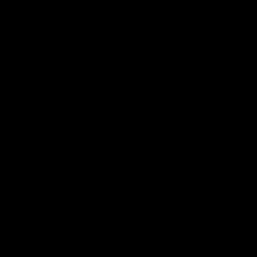

# O1 Scenario

## Abstract

The O1 scenario is about Object Permanence.

## Physical principles

Objects don't pop in and out of existence

## Computational challenge

Occlusion-resistent object tracking

## General description

### Train

* Every train sequence are possible.
* One run in each train scene.
* From 1 to 3 actors per scene.
* From 0 to 2 occluders.
* Random locations and rotations of actors and occluders.
* Random forces applied to actors.
* Random textures are applied to the floor, the occluders and the actors
* Occluders movements are random and sporadic.
* Actors can only be spheres.

### Test

* Four runs in each test scene.
* From 1 to 3 actors per scene.
* Actors can only be spheres.
* Random textures are applied to the floor, the occluders and the actors.

#### Visible

* No occluders.

##### Static

* The actor(s) do(es)n't move.

###### Possible 1

###### Possible 2

###### Impossible 1

* One actor start visible and become invisible in a random frame.

###### Impossible 2

* One actor start invisible and become visible in a random frame.

##### Dynamic 1

* The actor(s) can either spawn at the left or the right of the scene.
* A force will apply to it/them, making it/them roll to the other side of the scene.

###### Possible 1

###### Possible 2

###### Impossible 1

* One actor start visible and become invisible in a random frame.

###### Impossible 2

* One actor start invisible and become visible in a random frame.

##### Dynamic 2

* The actor(s) can either spawn at the left or the right of the scene.
* A force will apply to it/them, making it/them roll to the other side of the scene.

###### Possible 1

* One actor is visible.

###### Possible 2

* One actor is invisible.

###### Impossible 1

* One actor starts visible, becomes invisible in a random frame, then becomes visible again in another random frame.

###### Impossible 2

* One actor starts invisible, becomes visible in a random frame, then becomes invisible again in another random frame.

#### Occluded

##### Static

* The occluder stands up then gets down.

###### Possible 1

###### Possible 2

###### Impossible 1

* One actor is visible and disapear when the occluder get down.

###### Impossible 2

* One actor is invisible and apear when the occluder get down.

##### Dynamic 1

* One occluder spawns, up, in the center of the scene.
* The occluder gets down.
* The actor(s) can either spawn at the left or the right of the scene.
* A force will apply to it/them, making it/them roll to the other side of the scene.

###### Possible 1

###### Possible 2

###### Impossible 1

* One actor is visible and disapear as it goes behind the occluder.

###### Impossible 2

* One actor is invisible and apear coming from the back of the occluder.

##### Dynamic 2

* Two occluders spawn, up, at equal distances from the center of the scene.
* The occluders get down.
* The actor(s) can either spawn at the left or the right of the scene.
* A force will apply to it/them, making it/them roll to the other side of the scene.

###### Possible 1

###### Possible 2

###### Impossible 1

* One actor starts visible, becomes invisible as it goes behind the first occluder, then becomes visible again as it goes behind the second one.

###### Impossible 2

* One actor starts invisible, becomes invisible coming from behind the first occluder, then becomes invisible again as it goes behind the second one.

