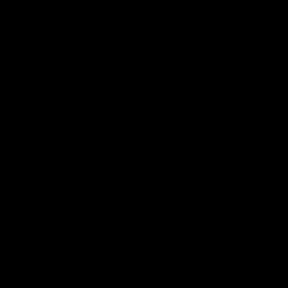

# O2 Scenario

## Abstract

The O2 scenario is about shape constancy.

## Physical principles

Objects keep their shape.

## Computational challenge

Appearance-robust object tracking.

## General description

### Train

* Every train sequence are possible.
* One run in each train scene.
* From 1 to 3 actors per scene.
* From 0 to 2 occluders.
* Random locations and rotations of actors and occluders.
* Random forces applied to actors.
* Random textures are applied to the floor, the occluders and the actors.
* Occluders movements are random and sporadic.
* Actors can be spheres, cubes or cones.

### Test

* Four runs in each test scene.
* From 1 to 3 actors per scene.
* Actors can be spheres, cubes or cones.
* Random textures are applied to the floor, the occluders and the actors.
* A magic actor is randomly chosen among the spawned actors.

#### Visible

* No occluders.

##### Static

* The actor(s) do(es)n't move.

###### Possible 1

* Magic actor keeps its shape and texture.

###### Possible 2

* Magic actor keeps its shape and texture (but it is another one than the previous run).

###### Impossible 1

* Magic actor start with a shape and changes it in a random frame.

###### Impossible 2

* Magic actor start with a shape and changes it in a random frame (but the other way around than in the previous run).

##### Dynamic 1

* The actor(s) can either spawn at the left or the right of the scene.
* A force will apply to it/them, making it/them fly to the other side of the scene.

###### Possible 1

* Magic actor keeps its shape and texture.

###### Possible 2

* Magic actor keeps its shape and texture (but not the same from the previous run).

###### Impossible 1

* Magic actor start with a shape and changes it in a random frame.

###### Impossible 2

* Magic actor start with a shape and changes it in a random frame (but the other way around than in the previous run).

##### Dynamic 2

* The actor(s) can either spawn at the left or the right of the scene.
* A force will apply to it/them, making it/them fly to the other side of the scene.

###### Possible 1

* Magic actor keeps its shape and texture.

###### Possible 2

* Magic actor keeps its shape and texture (but not the same from the previous run).

###### Impossible 1

* Magic actor starts with a shape, changes it in a random frame, then comes back to its original state in another random frame.

###### Impossible 2

* Magic actor starts with a shape, changes it in a random frame, then comes back to its original state in another random frame (but the other way around than in the previous run).

#### Occluded

##### Static

* One occluder spawns, down, between the camera and the magic actor.
* The occluder stands up then gets down.

###### Possible 1

* Magic actor keeps its shape and texture.

###### Possible 2

* Magic actor keeps its shape and texture (but not the same from the previous run).

###### Impossible 1

* Magic actor starts with a shape and changes it when the occluder gets down.

###### Impossible 2

* Magic actor starts with a shape and changes it when the occluder gets down (but the other way around than in the previous run).

##### Dynamic 1

* One occluder spawns, up, in the center of the scene.
* The occluder gets down.
* The actor(s) can either spawn at the left or the right of the scene.
* A force will apply to it/them, making it/them fly to the other side of the scene.

###### Possible 1

* Magic actor keeps its shape and texture.

###### Possible 2

* Magic actor keeps its shape and texture (but not the same from the previous run).

###### Impossible 1

* Magic actor starts with a shape and changes it as it goes behind the occluder.

###### Impossible 2

* Magic actor starts with a shape and changes it as it goes behind the occluder (but the other way around than in the previous run).

##### Dynamic 2

* Two occluders spawn, up, at equal distances from the center of the scene.
* The occluders get down.
* The actor(s) can either spawn at the left or the right of the scene.
* A force will apply to it/them, making it/them fly to the other side of the scene.

###### Possible 1

* Magic actor keeps its shape and texture.

###### Possible 2

* Magic actor keeps its shape and texture (but not the same from the previous run).

###### Impossible 1

* Magic actor starts with a shape, changes it as it goes behind the first occluder, then comes back as it was when it goes behind the second one.

###### Impossible 2

* Magic actor starts with a shape, changes it as it goes behind the first occluder, then comes back as it was when it goes behind the second one (but the other way around than it was in the previous run).

