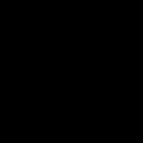

# O4 Scenario

## Abstract

The O4 scenario is about Energy and momentum.

## Physical principles

Constant kinetic energy and momentum.

## Computational challenge

Tracking/predicting object trajectories.

## General description

### Train

* Every train sequence are possible.
* One run in each train scene.
* From 1 to 3 actors per scene.
* From 0 to 2 occluders.
* Random locations and rotations of actors and occluders.
* Random forces applied to actors.
* Random textures are applied to the floor, the occluders and the actors
* Occluders movements are random and sporadic.
* Actors can only be spheres.

### Test

* Four runs in each test scene.
* From 1 to 3 actors per scene.
* Actors can only be spheres.
* Random textures are applied to the floor, the occluders and the actors.

#### Visible

* No occluders.

##### Static

* The actor(s) do(es)n't move at the start.

###### Possible 1

###### Possible 2

###### Impossible 1

* One actor spawns and then rolls away.

###### Impossible 2

* One actor spawns (but at a different place than the previous run) and then rolls away.

##### Dynamic 1

* The actor(s) can either spawn at the left or the right of the scene.
* A force will apply to it/them, making it/them roll to the other side of the scene.

###### Possible 1

###### Possible 2

###### Impossible 1

* One actor spawns and then changes trajectory at a random frame.

###### Impossible 2

* One actor spawns (but at a different place than the previous run) and then changes trajectory at a random frame.

##### Dynamic 2

* The actor(s) can either spawn at the left or the right of the scene.
* A force will apply to it/them, making it/them roll to the other side of the scene.

###### Possible 1

###### Possible 2

###### Impossible 1

* One actor spawns, changes trajectory at a random frame, then changes it again.

###### Impossible 2

* One actor spawns, changes trajectory at a random frame, then changes it again.

#### Occluded

##### Static

* The occluder stands up then gets down.

###### Possible 1

###### Possible 2

###### Impossible 1

* One actor start moving when occluder is up.

###### Impossible 2

* One actor start moving when occluder is up.

##### Dynamic 1

* One occluder spawns, up, in the center of the scene.
* The occluder gets down.
* The actor(s) can either spawn at the left or the right of the scene.
* A force will apply to it/them, making it/them roll to the other side of the scene.

###### Possible 1

###### Possible 2

###### Impossible 1

* One actor changes trajectory when going behind occluder.

###### Impossible 2

* One actor changes trajectory when going behind occluder.

##### Dynamic 2

* Two occluders spawn, up, at equal distances from the center of the scene.
* The occluders get down.
* The actor(s) can either spawn at the left or the right of the scene.
* A force will apply to it/them, making it/them roll to the other side of the scene.

###### Possible 1

###### Possible 2

###### Impossible 1

* One actor changes trajectory when going behind each occluder.

###### Impossible 2

* One actor changes trajectory when going behind each occluder.

