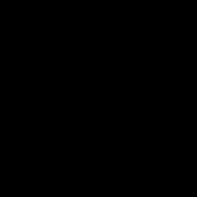

# GENERAL PRESENTATION

## SCENARIOS

Each scenario has a physical principle which will be broken in impossible runs and a computational challenge which will be tested by eponym videos.

## VIDEO TYPES LEXICON

### Run

A run is composed of 3 videos:

#### Scene

#### Mask

#### Depth

### Train

Train runs are all possibles sequences.
They are much random.
There is one run per train scene.

### Test

Tests runs are less random than the trains runs.

#### There are 4 runs per test scene : 2 possibles and 2 impossibles

##### Possible run examples

##### Impossible run examples

#### A test scene can be :

##### Visible

* There is no occluder in this one.

##### Occluded

* There is occluders in this one.

#### A test scene can be :

##### Static

* The actors don't move.
* If the scene is occluded, there is one occluder.
* The occluder (if present) can rotate.

##### Dynamic 1

* The actors move.
* If the scene is occluded, there is one occluder.
* The occluder (if present) can rotate.
* The actors can spawn either at the left or the right of the scene.
* The actors go alongside in the direction of the other side of the scene.

##### Dynamic 2

* The actors move.
* If the scene is occluded, there is two occluders.
* The occluder (if present) can rotate.
* The actors can spawn either at the left or the right of the scene.
* The actors go alongside in the direction of the other side of the scene.

## OBJECTS LEXICON

### Actor

* An actor can be a sphere, a cube or a cone from differents textures.
* Forces can be applied to them in trains or dynamic tests.
* They submit to the physic laws.

### Occluder

* An occluder is a rectangle which can spawn either up or down.
* It will stand up and go down during video.
* Movement speed can change.
* It can spawn in occluded tests or trains.
* They don't submit to physic laws.
